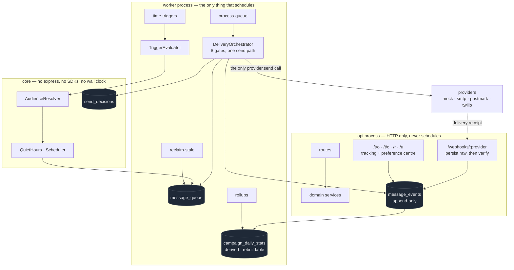

# Campaign Engine

A multi-channel campaign and lifecycle messaging engine that can prove why it sent
a message — and, more usefully, why it didn't.

An operator defines a campaign: a trigger, an audience, and a sequence of email and
SMS messages. When a trigger fires, the engine decides who is enrolled, renders each
message, schedules it against the recipient's local quiet hours, and a worker
delivers it through a provider adapter. Every open, click, delivery receipt, bounce,
complaint and opt-out flows back as an immutable event, and all analytics are derived
from those events rather than from counters.

> **This is a personal project, not a system I shipped at work.** The architecture and
> the invariants below come from seven months debugging a production notification
> service; the code is written from scratch and shares nothing with it. Several
> decisions here are deliberately *different* from what that experience exposed me to,
> and those differences are the parts I most want to talk about.

**Status:** the engine, the AI layer and the operator UI all build and run; 504
tests pass; the demo replays 30 days in about a minute. Not deployed yet. See
[TRACKER.md](TRACKER.md), which is accurate about what is not built.

---

## The thing worth looking at

Anyone can wire a provider SDK to a cron job. The part that separates a messaging
system that works in a demo from one that works in production is a set of guarantees
about what it will *refuse* to do — and whether those guarantees survive contact with
concurrency, retries, timezones and a customer who changes their mind.

This repository encodes fourteen of those as named tests that run as their own CI job.

| # | Invariant | The failure it prevents | Test |
|---|---|---|---|
| **I1** | Every gate — consent, suppression, quiet hours, frequency cap, stop conditions — is evaluated **at send time**, not only at enqueue. | A guard implemented in the enqueue path while the bulk, retry and event-triggered paths bypass it. *A guard that exists in one of four code paths is not a guard.* | [`architecture`](tests/unit/architecture.test.ts) |
| **I2** | The environment guard runs **before** the queue row is claimed. | A non-production worker pointed at a production database claims a row, burns a retry, declines to send, and permanently fails a message production would have sent. Invisible in production, because production never refuses. | [`i2`](tests/invariants/i2-env-guard-precedes-claim.test.ts) |
| **I3** | **Claiming** is exactly-once and crash-safe: `SELECT … FOR UPDATE SKIP LOCKED`, a `claimed_by` stamp, and every terminal writer fenced on it. **Delivery is at-least-once** — see the note below. | Messages stuck forever because the worker that claimed them died; two workers writing contradictory results for the same row. | [`i3`](tests/invariants/i3-concurrent-claim-exactly-once.test.ts) |
| **I4** | Deduplication is a **UNIQUE index on a generated column**, and a conflicting insert is an idempotent no-op. | Duplicate sends from concurrent triggers, webhook redeliveries and retried API calls. Application-level check-then-insert is banned. | [`i4`](tests/invariants/i4-dedup-is-a-database-constraint.test.ts) |
| **I5** | Quiet hours are computed in the **recipient's** timezone, falling back to the tenant default and never to the server's. Campaign config can narrow the window, never widen it. | Messages delivered at 02:03 local time. | [`i5`](tests/invariants/i5-quiet-hours-recipient-local.test.ts) |
| **I6** | Consent is an **append-only ledger**; suppression is an **address-level list**. Opting out cancels messages already queued. | Opt-outs honoured only for contacts carrying a flag; queued mail going out after the customer said stop; consent history destroyed by an UPDATE. | [`i6`](tests/invariants/i6-optout-cancels-queued.test.ts) |
| **I7** | A marketing message cannot be scheduled unless its rendered body contains a **resolvable** opt-out — asserted by booting the app and fetching the generated URL. | An unsubscribe link pointing at a route that does not exist. Every recipient reaches a blank page, for the entire life of the system, because nobody ever clicked one. | [`i7`](tests/invariants/i7-unsubscribe-link-resolves.test.ts) |
| **I8** | Provider errors are classified terminal or transient from an explicit table. Terminal errors are **never** retried, and the provider's own error code is persisted. | Carrier-rejected messages resent three times each; forensics impossible because the stored error is the framework's, not the provider's. | [`i8`](tests/invariants/i8-terminal-errors-never-retried.test.ts) |
| **I9** | `delivered` is written **only** by a provider receipt. It is never inferred from `sent`. | A delivery-rate metric that reads 100% because the code marks delivered on the line after sent. | [`i9`](tests/invariants/i9-delivered-requires-receipt.test.ts) |
| **I10** | A frequency cap is enforced at send time, and **a test asserts that changing the config changes the behaviour**. | Five cadence columns in the schema with zero backend readers. 48 messages to one recipient in seven days. | [`i10`](tests/invariants/i10-frequency-cap-enforced.test.ts) |
| **I11** | Webhook signature validation iterates **all** active credentials for a tenant and fails **closed**, retaining the raw payload for replay. | A single-row credential lookup that breaks when a tenant has three senders — every provider callback rejected with 403, for months, silently. | [`i11`](tests/invariants/i11-webhook-multi-credential.test.ts) |
| **I12** | Every rate has an explicit denominator, defined once and shown in the UI. Open rate is unique opens ÷ **delivered**. SMS has no open rate and the UI must not render one. | Rates computed over `sent`, or over a population including messages with no clickable link, grading campaigns wrongly. | [`i12`](tests/invariants/i12-metric-denominators.test.ts) |
| **I13** | Resolving a recipient from an order number returns `none \| single \| ambiguous`. It never silently picks the most recent match. | Order numbers are unique per store, not globally. Picking the newest match sends one customer's details to a different customer. | [`i13`](tests/invariants/i13-ambiguous-recipient.test.ts) |
| **I14** | Every enqueue **and every skip** writes a decision row with a machine-readable reason code and the inputs it was evaluated from. | An operator with no way to answer "why didn't this fire?" other than reading source code. | [`i14`](tests/invariants/i14-every-decision-is-logged.test.ts) |

**On I3, and why it says "at-least-once".** An earlier version of this README
claimed exactly-once delivery. An adversarial review proved that wrong, and the
correction is worth more than the original claim was.

Claiming really is exactly-once — that is what `SKIP LOCKED` buys, and every
terminal writer now carries an ownership fence so a worker that has lost its claim
writes nothing. But **delivery cannot be exactly-once here**, and no amount of care
in this codebase changes it: if a worker is inside `provider.send` when it is
presumed dead and its row is reclaimed, the request is already on the network and
cannot be recalled.

What was fixed is everything around that: the reclaim window is now measured per
message rather than per batch (a slow batch used to reclaim and re-send its own
tail, on one replica, deterministically), and the corrupt states are gone — a sent
message can no longer be recorded as failed, and a delivered one can no longer be
put back in the claimable queue. What remains is handed to the provider as an
idempotency key, because provider-side deduplication is the only place a duplicate
can still be collapsed.

All fourteen have passing tests, and so do the ten AI invariants (V1–V10) covering
the deterministic/model boundary, versioned prompts, a golden eval set that blocks a
merge on regression, a per-tenant token budget, and — the one worth reading —
**V9: the model can only ever ADD a suppression, never remove one**, enforced by
handing the classifier a narrowed capability object rather than by a rule.

Full write-ups in [`docs/INVARIANTS.md`](docs/INVARIANTS.md).

---

## What an adversarial review of it found

The invariants above are the claim. This is the check on the claim.

Four reviewers were pointed at the queue, the consent and scheduling logic, the
HTTP layer and the AI invariants, each required to prove a finding with a
**failing test** rather than an opinion. Six bugs were confirmed, and **four of
them were in the guards themselves** — the code whose entire purpose is to be
correct. A guard that is wrong is worse than no guard, because the system reports
that it is protected.

The ones worth reading, all fixed, all written up in
[`docs/DECISIONS.md`](docs/DECISIONS.md) D19–D25:

- **Opt-out detection required the whole message to equal a keyword.** So
  `"STOP\n\nSent from my iPhone"` — the most common physical shape of an emailed
  opt-out — fell through to the model, where an outage drops it entirely. And
  `"STOP STOP STOP"` was not an opt-out at all.
- **The same function, the other way.** `CANCEL` is an *SMS carrier* keyword and
  was being applied to email, so a one-word "Cancel" reply to "reply CANCEL to
  cancel your order" wrote a permanent suppression that then blocked that person's
  own refund and shipping notices.
- **`ON CONFLICT DO NOTHING` silently discarded hard bounces** when a lapsed
  soft-bounce row was still sitting on the unique key.
- **One misconfigured campaign aborted the whole queue batch**, stranding
  unrelated messages until they were burned to permanent failure.

The result that found nothing is the one that matters most: **V9 held.** Hostile
payloads carrying `resubscribe: true` and `suppression: {action: 'remove'}`,
driven through every branch at confidence 1.0, never reached anything that
removes, weakens or shortens a suppression.

The review also proved that three claims in the comments of the file making the
strongest guarantee were **false**, and that one of its test assertions could
never fail. Those are corrected too. An overstated guarantee is worse than an
honest narrow one.

There is also `npm run smoke`, which boots a real Postgres and starts the actual
api and worker processes and talks to them over HTTP — because "the tests pass"
and "the server starts" are different claims. It was written after a runtime
check found the worker had no entry point at all: 519 passing tests, and the
process could not start.

---

## Architecture



Two processes, one image. The API process is structurally forbidden from
registering a scheduler — three API replicas would mean every job firing three
times, and a long job would block the health check until the platform restarted the
container mid-run.

---

## Five decisions, and what each one costs

**PostgreSQL is the queue.** No Redis, no broker. The property that earns it is
transactional enqueue: a message can be queued in the same transaction as the
business write that caused it, which a separate broker cannot do without an outbox
and a relay. What it costs is fan-out, cross-region replication, and a ceiling
somewhere in the low thousands of messages per minute on modest hardware. The
threshold at which I would move is written down rather than left as a shrug.

**Analytics are event-sourced.** `message_events` is append-only and is the only
source of truth; the daily rollup is derived and can be dropped and rebuilt.
Counters incremented in-line by the sender are banned, because they drift — a crash
between the send and the increment, a retry that increments twice — and once a
counter has drifted there is no way to recover the truth, since the evidence was
never written down.

**Consent is a ledger, not a boolean.** A boolean answers "are they opted in?" and
nothing else. It cannot answer "were they opted in on 4 March, and where did that
consent come from?", which is the question that actually gets asked. The database
refuses `UPDATE` and `DELETE` on that table, so it is a guarantee rather than a
convention.

**The mock provider is a first-class citizen.** It writes to a real outbox table,
assigns simulated outcomes from configured rates, and fires delayed delivery and
bounce webhooks back into the real webhook endpoint. The whole system runs with zero
credentials, which is the difference between a reviewer trying it and not.

**The domain never reads the wall clock.** Every time-dependent decision takes an
injected `Clock`. This is what makes "three days after the order is delivered" a
three-millisecond test instead of a three-day one, and it is what lets the demo
fast-forward thirty days of behaviour in about a minute.

---

## Running it

Requires Node 24. **No Docker daemon and no root needed** — the test and dev
databases are real PostgreSQL 18 servers started as child processes.

```bash
git clone https://github.com/vipinsao/campaign-engine
cd campaign-engine
npm install
npm test          # boots a real Postgres, migrates it, runs everything
```

There is deliberately no `docker-compose.yml` yet — it is listed under "not built
yet" below rather than mentioned as though it exists.

```bash
npm run typecheck   # tsc, and a test proves this gate is not a no-op
npm run lint        # eslint, including the architecture boundary rules
npm test            # unit + integration + invariants
```

### See it actually run

```bash
npm run dev          # boots Postgres, migrates, starts api + worker + web
npm run seed:demo    # deterministic: 500 contacts, 1,200 orders, 5 campaigns
npm run demo:simulate # replays 30 days in about a minute
```

`demo:simulate` advances a `FakeClock` in one-hour steps and drives the trigger
evaluator and the worker at every tick, so a month of campaign behaviour is
watchable in about a minute. It ends by printing the decision log — the reasons
messages did *not* send. See [`docs/DEMO.md`](docs/DEMO.md).

---

## Deliberately not built

Knowing what was left out matters as much as the list above.

- **Not a full ESP.** No deliverability infrastructure, IP warming, DKIM/SPF
  management or MTA.
- **No WYSIWYG email designer.** HTML plus a live preview is enough; a visual
  designer is a large project with nothing to prove here.
- **No A/B testing.** The campaign version snapshot is where it would attach.
- **Single region, single database.** The scale-out path is documented with the
  threshold at which it becomes worth doing.
- **No GDPR data-subject-request tooling**, though the consent ledger is the
  substrate it would need.

## Not built *yet*

Distinct from the above, and tracked in [TRACKER.md](TRACKER.md):

- **Not deployed.** The Dockerfile, `docker-compose.yml` and `render.yaml` exist
  and the CI workflow is written, but nothing has been pushed or deployed, so there
  is no live URL and no green badge yet.
- **Five API endpoints the UI wants do not exist**, and the affected panels say so
  on screen rather than inventing data: `GET /mock-outbox`, a tenant-settings
  endpoint for the quiet-hours floor, `GET /campaigns/:id/timeseries`, contact
  lookup by email, and per-channel campaign counts.
- **`/queue` has no total count**, so every list built on it is a 200-row window.
  Each one says so.
- **The web bundle is 1.07 MB** — Recharts and React Flow are both eagerly
  imported. Route-level lazy loading would roughly halve it.
- **`packages/web` is excluded from ESLint**, so the UI has no lint gate; the
  type-check is currently the only thing catching it.

Saying this is cheaper than having a reviewer discover it.

---

## Documentation

- [`docs/INVARIANTS.md`](docs/INVARIANTS.md) — all 23 invariants, each with the
  production failure it prevents and a link to its test.
- [`docs/DECISIONS.md`](docs/DECISIONS.md) — every judgment call, with the reasoning
  at the time. Includes the defects found in the original build specification and
  why following it literally would have shipped bugs.
- [`docs/ARCHITECTURE.md`](docs/ARCHITECTURE.md) — the two-process split, the
  package boundaries and how they are enforced, and the send-time gate chain.
- [`docs/DEMO.md`](docs/DEMO.md) — a numbered sixty-second click-through.
- ADRs: [Postgres as the queue](docs/ADR-001-postgres-queue.md) ·
  [event-sourced analytics](docs/ADR-002-event-sourced-analytics.md) ·
  [the consent ledger](docs/ADR-003-consent-ledger-vs-boolean.md) ·
  [the injectable clock](docs/ADR-004-injectable-clock.md) ·
  [decision-log retention](docs/ADR-005-decision-log-retention.md)
- [`TRACKER.md`](TRACKER.md) — build state, per phase.

## Licence

MIT.
